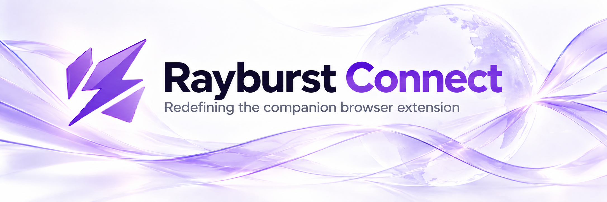

<div align="center">
  
  <p><strong>Redefining the companion browser extension.</strong></p>
  <p>Send browser downloads and media to <a href="https://github.com/AnInsomniacy/rayburst">Rayburst</a>.</p>


</div>

> [!IMPORTANT]
> **Motrix Next Extension is now Rayburst Connect.** This code requires Rayburst 4 or later and uses new browser identities. Previous extension settings are not imported. Browser store publication is managed separately; existing store builds may still target the previous desktop app. Use a Rayburst Connect release or build from source below.

---

## Features

- **Page media discovery** — Detect HLS/DASH manifests and audio/video sources without interrupting playback. Inspect and choose native tracks from the extension's Sniffer tab, sidebar or full-page workspace through Rayburst's [media API](docs/MEDIA_API.md). See [scope and local testing](docs/MEDIA.md).

- **Download interception** — Automatically captures browser downloads and routes them to Rayburst for multi-threaded acceleration
- **Smart filtering** — Ordered checks for interception settings, extension-owned downloads, URL schemes, site rules, MIME types, file extensions, and minimum file size
- **Per-site rules** — Glob-pattern rules (e.g. `*.github.com`) to always intercept, always skip, or defer to global settings
- **Context menu** — Right-click any link, image, audio, or video → "Download with Rayburst"
- **Magnet & torrent** — `magnet:` URIs and `.torrent` files are automatically captured and routed to aria2
- **Cookie forwarding** — Cookie forwarding is enabled by default for authenticated downloads and uses required cookie and site permissions
- **Real-time dashboard** — Popup shows live download/upload speeds, active/waiting/completed task counts
- **Auto-launch** — Activates Rayburst through its allowlisted Native Messaging host, waits for API readiness, then retries
- **Duplicate notifications** — Alerts when a repeated download request is skipped
- **Download bar control** — Optionally hides Chrome's native download shelf (Chromium 115+, not available on Firefox)
- **Dark mode** — System / Light / Dark with 10 Material You color schemes
- **i18n** — 27 languages including English, Hindi, Chinese, Japanese, Korean, French, German, Spanish, and more
- **Diagnostics** — Privacy-sanitized outcome log with severity filters, configurable bounded history (100 events by default), and one-click export

## Installation

### From GitHub Releases

Download `rayburst-connect-x.x.x-chromium-mv3.zip` or `rayburst-connect-x.x.x-firefox-mv3.zip` from [Releases](https://github.com/AnInsomniacy/rayburst-connect/releases), unpack it, then load it as described under [From Source](#from-source). If no Rayburst Connect package is available yet, build from source below.

### From Source

```bash
git clone https://github.com/AnInsomniacy/rayburst-connect.git
cd rayburst-connect
pnpm install

# Chrome / Edge
pnpm build

# Firefox
pnpm build:firefox
```

Then load the unpacked extension:

**Chrome / Edge:**

1. Navigate to `chrome://extensions` (or `edge://extensions`)
2. Enable **Developer mode**
3. Click **Load unpacked**
4. Select the `.output/chromium-mv3` directory

**Firefox:**

1. Navigate to `about:debugging#/runtime/this-firefox`
2. Click **Load Temporary Add-on...**
3. Select `.output/firefox-mv3/manifest.json`

## FAQ

<details>
<summary><strong>What is Rayburst?</strong></summary>

<br>

[Rayburst](https://github.com/AnInsomniacy/rayburst) is a full-featured download manager powered by Aria2 Next, built with Tauri 2, Vue 3, and Rust. This extension bridges your browser to the Rayburst desktop app running on your local machine.

</details>

<details>
<summary><strong>Do I need the desktop app?</strong></summary>

<br>

Yes. This extension sends downloads to the Rayburst desktop app via its HTTP API on `127.0.0.1:29110`. Without the desktop app running, the extension will show a "Disconnected" status and cannot process downloads.

</details>

<details>
<summary><strong>Why does the extension request broad host permissions?</strong></summary>

<br>

The broad host permissions (`*://*/*`) are required so cookie forwarding works immediately for authenticated downloads from any site. The `chrome.cookies.getAll()` and `webRequest` APIs require matching host permissions for the target domain, and browser downloads can originate from any domain. The same access lets the extension preserve filtered request context and, on Firefox, identify attachment and binary responses before the native save dialog opens. Cookies and filtered request metadata are sent only to the Rayburst API on `127.0.0.1`. Users can disable cookie forwarding and request header forwarding in Settings.

</details>

<details>
<summary><strong>Does this extension collect any data?</strong></summary>

<br>

No personal data is sent to the developer or third parties. Settings, diagnostics and discovered media context are stored locally. Task handoff and capture storage use the local Rayburst API (`127.0.0.1`). User-requested previews connect directly to the selected media source. No analytics or telemetry. See the [full Privacy Policy](PRIVACY_POLICY.md).

</details>

## Development

### Prerequisites

- [Node.js](https://nodejs.org/) 24.16.0 LTS
- [pnpm](https://pnpm.io/) 10.34.1
- [Rayburst](https://github.com/AnInsomniacy/rayburst) desktop app running

### Setup

```bash
# Install dependencies
pnpm install

# Start the development server with hot reload
pnpm dev

# WXT launches Chrome with the extension in a persistent development profile.

# Build for production
pnpm build

# Package as .zip for store submission
pnpm zip
```

### Project Structure

```
rayburst-connect/
├── entrypoints/                # Extension entry points
│   ├── background.ts           #   Service worker — orchestrator wiring, listeners
│   ├── content.ts              #   Protocol links, media discovery and player controls
│   ├── media/App.vue           #   Media sidebar and full-page workspace
│   ├── popup/App.vue           #   Browser action popup — status, speed, task dashboard
│   └── options/App.vue         #   Full-page settings — one staged-snapshot state model
├── lib/                        # Core logic
│   ├── schema.ts               #   Zod schemas — single source of types + defaults
│   ├── storage.ts              #   Schema-validated browser.storage access
│   ├── api.ts                  #   Desktop HTTP API client + error taxonomy
│   ├── desktop.ts              #   Native Messaging activation + readiness coordination
│   ├── browser.ts              #   Permissions, context menu, webRequest helpers
│   ├── backup.ts               #   Settings backup import/export
│   ├── diagnostics.ts          #   Sanitized, serialized diagnostic journal
│   ├── download/               #   Orchestrator, filter pipeline, request context
│   └── media/                  #   Discovery, source catalogue, inspection and submission
├── shared/                     # Shared UI infrastructure
│   ├── i18n/                   #   Runtime i18n engine + virtual:locales loader
│   └── theme.ts                #   M3 color system — bootstrap, CSS vars, Naive UI
├── __tests__/                  # Behavior-level unit + integration tests
├── public/_locales/            # Chrome i18n message bundles (27 languages, SSOT)
└── .github/workflows/ci.yml   # CI: compile → test → lint → i18n → format → build
```

### Scripts

| Command              | Description                                             |
| -------------------- | ------------------------------------------------------- |
| `pnpm dev`           | Build the Chrome development extension with hot reload  |
| `pnpm dev:firefox`   | Build the Firefox development extension with hot reload |
| `pnpm build`         | Production build → `.output/chromium-mv3/`              |
| `pnpm build:firefox` | Production build → `.output/firefox-mv3/`               |
| `pnpm zip`           | Package Chromium build as `.zip` for store submission   |
| `pnpm zip:firefox`   | Package Firefox build as `.zip` for AMO submission      |
| `pnpm zip:all`       | Package both Chrome and Firefox builds                  |
| `pnpm test`          | Run all unit and integration tests                      |
| `pnpm test:watch`    | Run tests in watch mode                                 |
| `pnpm compile`       | TypeScript type checking (`vue-tsc --noEmit`)           |
| `pnpm lint`          | ESLint (flat config, Vue 3 + TypeScript)                |
| `pnpm lint:i18n`     | Validate i18n key consistency across all locales        |
| `pnpm format`        | Auto-format all files with Prettier                     |
| `pnpm format:check`  | Verify formatting without writing                       |

### Testing

Tests run on Vitest with WXT’s `fakeBrowser` polyfill for extension APIs. Run the full suite before committing:

```bash
pnpm format:check && pnpm lint && pnpm compile && pnpm test && pnpm build
```

### Test Site

A self-contained static page for manually verifying download interception:

```bash
npx serve test-site -p 3001
```

Covers: Apple IPSW direct links, `.torrent` files, `magnet:` URIs, Linux ISOs, speed test binaries, and edge cases (`blob:`, `data:`).

## Contributing

PRs and issues are welcome! Before submitting:

1. Fork the repository
2. Create a feature branch (`git checkout -b feature/amazing-feature`)
3. Ensure all quality gates pass (`pnpm format:check && pnpm lint && pnpm compile && pnpm test`)
4. Commit your changes (`git commit -m 'feat: add amazing feature'`)
5. Push to the branch (`git push origin feature/amazing-feature`)
6. Open a Pull Request

## Sponsor

Downloads go faster. Thesis progress does not. If you'd like to help with at least one of those —

[Consider sponsoring the project ❤️](https://github.com/AnInsomniacy/AnInsomniacy/blob/main/SPONSOR.md) — your support keeps the code open, the releases shipping, and proof that a PhD can ship more than just papers.

## License

[MIT](https://opensource.org/licenses/MIT) — Copyright (c) 2025-present AnInsomniacy
